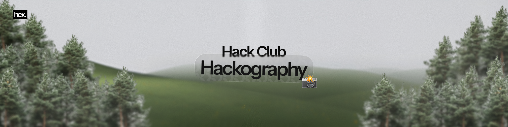

  <h1>Hack Club Hackography / hackography-ysws.hexaa.sh</h1>
  
Hack Club's (drafted) YSWS campaign where you must ship a project that involves with your webcam.

  <a href="https://hexaa.sh/hackography" target="_blank">hackography.hexaa.sh</a>
  &nbsp;
  <a href="https://hexaa.sh/hackography-ysws" target="_blank">rsvp now</a>
  &nbsp;
  <a href="https://hackclub.slack.com/archives/C09NS7PD5DF" target="_blank">#hackography</a>

## Introduction

Alright so, <i>what is Hackography?</i> Hackography is another Hack Club YSWS. Ship your app that interacts with your camera (webcam, phone camera, etc.) and we'll ship you an OBS Bot webcam!

## Tech Stack

- Next.js 16
- React 19
- Typescript 5
- TailwindCSS 4
- Framer Motion
- GSAP
- Lucide Icon & React Icons Pack
- Biome Linter & Formatter

## Special Thanks to

  <a href="https://siege.hackclub.com/?ref=432">
    </img>
  </a>
  &nbsp;&nbsp;&nbsp;&nbsp;&nbsp;
  <a href="https://hackclub.com">
    </img>
  </a>

